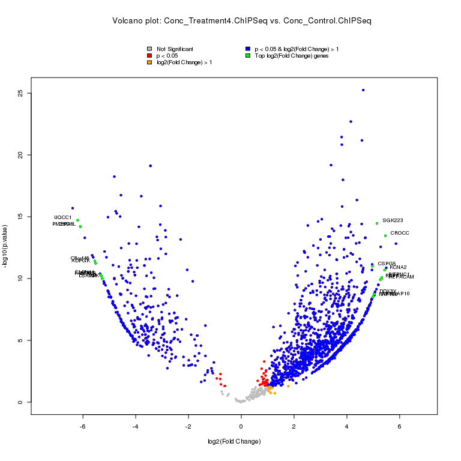
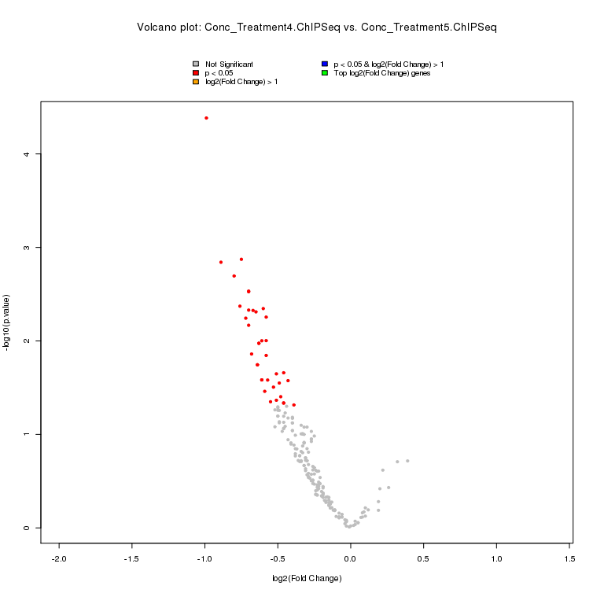
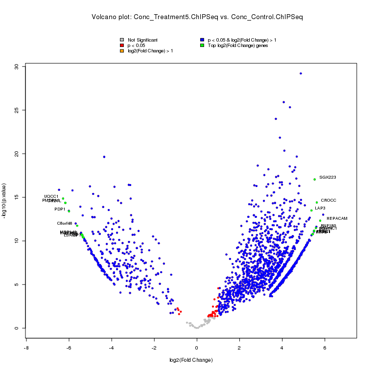

# DiffBind Volcano Plots
Stephen Kelly  
9/13/2016  


## DiffBind ChIP-Seq Differential Peaks

DiffBind is used to determine which peaks in a ChIP-Seq experiment are differential bound between sample data sets. For this report, we have subset the standard DiffBind data to plot only the single peak per gene which is closest to the gene's start site (e.g. lowest 'shortestDistance' value).

Information about the DiffBind program can be found here:

http://bioconductor.org/packages/release/bioc/vignettes/DiffBind/inst/doc/DiffBind.pdf

http://bioconductor.org/packages/release/bioc/html/DiffBind.html


## DiffBind Plots and Results {.tabset}  
  
Project dir:  
/ifs/home/kellys04/projects/Bioinformatics/DiffBind_scripts_reports/DiffBind_Volcano_Plot_report/input  
  
******  
### diff_bind.Treatment4-ChIPSeq-vs-Control-ChIPSeq.p100.csv {.tabset}  
<!-- -->  
  
  
******  
#### Overall DiffBind Stats  
Total number of DiffBind peaks:  
3192  
  
Total number of DiffBind genes:  
1824  
  
Total number positive fold change genes:  
1474  
  
Total number negative fold change genes:  
350  
  
  
******  
Total number of p <0.05 genes:  
1712  
  
Total number of p <0.05 genes (pos. FC):  
1377  
  
Total number of p <0.05 genes (neg. FC):  
335  
  
  
******  
Total number of log2(Fold Change) > 1 genes:  
1691  
  
Total number of log2(Fold Change) > 1 genes (pos. FC):  
1361  
  
Total number of log2(Fold Change) > 1 genes (neg. FC):  
330  
  
  
******  
Total number of p < 0.05 & log2(Fold Change) > 1 genes:  
1679  
  
Total number of p < 0.05 & log2(Fold Change) > 1 genes (pos. FC):  
1349  
  
Total number of p < 0.05 & log2(Fold Change) > 1 genes (neg. FC):  
330  
  
  
  
  
******  
#### Protein Coding Gene Stats  
Total number of DiffBind peaks:  
2030  
  
Total number of DiffBind genes:  
1113  
  
Total number positive fold change genes:  
918  
  
Total number negative fold change genes:  
195  
  
  
******  
Total number of p <0.05 genes:  
1037  
  
Total number of p <0.05 genes (pos. FC):  
851  
  
Total number of p <0.05 genes (neg. FC):  
186  
  
  
******  
Total number of log2(Fold Change) > 1 genes:  
1021  
  
Total number of log2(Fold Change) > 1 genes (pos. FC):  
840  
  
Total number of log2(Fold Change) > 1 genes (neg. FC):  
181  
  
  
******  
Total number of p < 0.05 & log2(Fold Change) > 1 genes:  
1011  
  
Total number of p < 0.05 & log2(Fold Change) > 1 genes (pos. FC):  
830  
  
Total number of p < 0.05 & log2(Fold Change) > 1 genes (neg. FC):  
181  
  
  
  
******  
  
******  
### diff_bind.Treatment4-ChIPSeq-vs-Treatment5-ChIPSeq.p100.csv {.tabset}  
<!-- -->  
  
  
******  
#### Overall DiffBind Stats  
Total number of DiffBind peaks:  
279  
  
Total number of DiffBind genes:  
207  
  
Total number positive fold change genes:  
19  
  
Total number negative fold change genes:  
187  
  
  
******  
Total number of p <0.05 genes:  
37  
  
Total number of p <0.05 genes (pos. FC):  
0  
  
Total number of p <0.05 genes (neg. FC):  
37  
  
  
******  
Total number of log2(Fold Change) > 1 genes:  
0  
  
Total number of log2(Fold Change) > 1 genes (pos. FC):  
0  
  
Total number of log2(Fold Change) > 1 genes (neg. FC):  
0  
  
  
******  
Total number of p < 0.05 & log2(Fold Change) > 1 genes:  
0  
  
Total number of p < 0.05 & log2(Fold Change) > 1 genes (pos. FC):  
0  
  
Total number of p < 0.05 & log2(Fold Change) > 1 genes (neg. FC):  
0  
  
  
  
  
******  
#### Protein Coding Gene Stats  
Total number of DiffBind peaks:  
176  
  
Total number of DiffBind genes:  
126  
  
Total number positive fold change genes:  
9  
  
Total number negative fold change genes:  
116  
  
  
******  
Total number of p <0.05 genes:  
22  
  
Total number of p <0.05 genes (pos. FC):  
0  
  
Total number of p <0.05 genes (neg. FC):  
22  
  
  
******  
Total number of log2(Fold Change) > 1 genes:  
0  
  
Total number of log2(Fold Change) > 1 genes (pos. FC):  
0  
  
Total number of log2(Fold Change) > 1 genes (neg. FC):  
0  
  
  
******  
Total number of p < 0.05 & log2(Fold Change) > 1 genes:  
0  
  
Total number of p < 0.05 & log2(Fold Change) > 1 genes (pos. FC):  
0  
  
Total number of p < 0.05 & log2(Fold Change) > 1 genes (neg. FC):  
0  
  
  
  
******  
  
******  
### diff_bind.Treatment5-ChIPSeq-vs-Control-ChIPSeq.p100.csv {.tabset}  
<!-- -->  
  
  
******  
#### Overall DiffBind Stats  
Total number of DiffBind peaks:  
3192  
  
Total number of DiffBind genes:  
1824  
  
Total number positive fold change genes:  
1485  
  
Total number negative fold change genes:  
339  
  
  
******  
Total number of p <0.05 genes:  
1782  
  
Total number of p <0.05 genes (pos. FC):  
1452  
  
Total number of p <0.05 genes (neg. FC):  
330  
  
  
******  
Total number of log2(Fold Change) > 1 genes:  
1751  
  
Total number of log2(Fold Change) > 1 genes (pos. FC):  
1425  
  
Total number of log2(Fold Change) > 1 genes (neg. FC):  
326  
  
  
******  
Total number of p < 0.05 & log2(Fold Change) > 1 genes:  
1751  
  
Total number of p < 0.05 & log2(Fold Change) > 1 genes (pos. FC):  
1425  
  
Total number of p < 0.05 & log2(Fold Change) > 1 genes (neg. FC):  
326  
  
  
  
  
******  
#### Protein Coding Gene Stats  
Total number of DiffBind peaks:  
2030  
  
Total number of DiffBind genes:  
1113  
  
Total number positive fold change genes:  
926  
  
Total number negative fold change genes:  
187  
  
  
******  
Total number of p <0.05 genes:  
1087  
  
Total number of p <0.05 genes (pos. FC):  
906  
  
Total number of p <0.05 genes (neg. FC):  
181  
  
  
******  
Total number of log2(Fold Change) > 1 genes:  
1066  
  
Total number of log2(Fold Change) > 1 genes (pos. FC):  
889  
  
Total number of log2(Fold Change) > 1 genes (neg. FC):  
177  
  
  
******  
Total number of p < 0.05 & log2(Fold Change) > 1 genes:  
1066  
  
Total number of p < 0.05 & log2(Fold Change) > 1 genes (pos. FC):  
889  
  
Total number of p < 0.05 & log2(Fold Change) > 1 genes (neg. FC):  
177  
  
  
  
******  
  
******  


### System Information


```r
system('uname -srv',intern=T)
```

```
## [1] "Linux 2.6.32-642.3.1.el6.x86_64 #1 SMP Tue Jul 12 18:30:56 UTC 2016"
```

```r
sessionInfo()
```

```
## R version 3.3.1 (2016-06-21)
## Platform: x86_64-redhat-linux-gnu (64-bit)
## Running under: CentOS release 6.8 (Final)
## 
## locale:
##  [1] LC_CTYPE=en_US.UTF-8       LC_NUMERIC=C              
##  [3] LC_TIME=en_US.UTF-8        LC_COLLATE=en_US.UTF-8    
##  [5] LC_MONETARY=en_US.UTF-8    LC_MESSAGES=en_US.UTF-8   
##  [7] LC_PAPER=en_US.UTF-8       LC_NAME=C                 
##  [9] LC_ADDRESS=C               LC_TELEPHONE=C            
## [11] LC_MEASUREMENT=en_US.UTF-8 LC_IDENTIFICATION=C       
## 
## attached base packages:
## [1] stats     graphics  grDevices utils     datasets  methods   base     
## 
## other attached packages:
## [1] calibrate_1.7.2  MASS_7.3-45      data.table_1.9.6
## 
## loaded via a namespace (and not attached):
##  [1] magrittr_1.5    formatR_1.4     tools_3.3.1     htmltools_0.3.5
##  [5] yaml_2.1.13     Rcpp_0.12.6     stringi_1.1.1   rmarkdown_1.0  
##  [9] knitr_1.13      stringr_1.0.0   digest_0.6.10   chron_2.3-47   
## [13] evaluate_0.9
```

```r
# save.image(compress = TRUE, )
```
